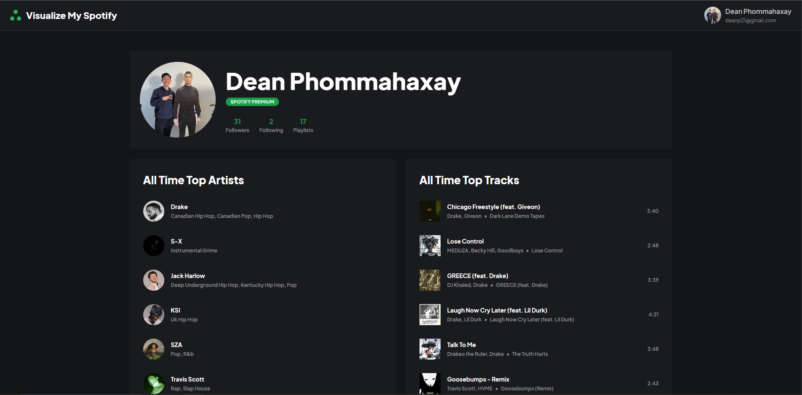

# Visualize My Spotify

## 🚀 Description

A [Next.js](https://nextjs.org/) web application that helps visualize your spotify profile and behaviour using:
- [Spotify Web Api](https://developer.spotify.com/documentation/web-api/) for spotify data
- [Mantine](https://mantine.dev/) for components and UI
- [NextAuth](https://next-auth.js.org/) for authentication



## 💻 Getting Started

### Spotify

Create a spotify account if you don't have one then access the [developer dashboard](https://developer.spotify.com/dashboard/login). Register a new application and the following redirect url: `http://localhost:3000/api/auth/callback/spotify`. If you are using a different port from `3000` then update the redirect url accordingly. You will need the `Client ID` and `Client Secret` for the next step.

### Installation And Setup

#### Install dependencies

```bash
yarn install
```
#### Environment Variables

Create a `.env.local` file in the root of the project and add the environment variables:

```bash
SPOTIFY_CLIENT_ID=<your-spotify-client-id>
SPOTIFY_CLIENT_SECRET=<your-spotify-client-secret>
NEXTAUTH_SECRET=<your-nextauth-secret>
```
Refer to the `.env.sample` file as a reference.

#### Run the development server on `localhost:3000`

```bash
yarn dev
```

### Usage

Upon running the development server with `yarn dev` you will be able to access the application on `localhost:3000`. Click on the `Login with Spotify` button to authenticate with your spotify account. The spotify web api authorizes using OAuth which NextAuth handles for you with a Spotify provider.

This application is gated behind authentication. Upon your first time logging in (or when authorization scopes change). Once authenticated you will be able to use the application.

More details will be added to the [docs](docs) when required, but these links should be helpful for now to understand how authentication/authorization works in this application: 
- [NextAuth Documentation](https://next-auth.js.org/)
  - [Explanation On OAuth Providers](https://next-auth.js.org/configuration/providers/oauth)
  - [Spotify Provider](https://next-auth.js.org/providers/spotify)
- [Spotify Web Api Documentation](https://developer.spotify.com/documentation/web-api/)
  - [Authorization Guide](https://developer.spotify.com/documentation/general/guides/authorization/)
  - [Authorization Scopes](https://developer.spotify.com/documentation/general/guides/scopes/)
  - [Web Api Reference](https://developer.spotify.com/documentation/web-api/reference/)

## 📕 Documentation

The practices and guidelines for this repository are inspired by [Bulletproof Next.js](https://github.com/alan2207/bulletproof-react) with some minor adjustments due to the project being a Next.js application instead of a React application.

The [docs](docs) folder contains some useful information and tutorials/explanations on how some things work in this application/codebase. The following links are a good place to start:
- [Project Structure](docs/project-structure.md)
- [Interacting With The Spotify Web API](docs/spoitfy-api-interaction.md)
